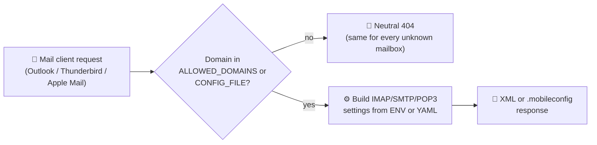

# mail-autodiscover

<p align="center">
  <a href="https://github.com/solarssk/mail-autodiscover/actions/workflows/ci.yml"></a>
  &nbsp;
  <a href="https://codecov.io/gh/solarssk/mail-autodiscover"></a>
  &nbsp;
  <a href="https://sonarcloud.io/summary/new_code?id=solarssk_mail-autodiscover"></a>
  &nbsp;
  <a href="https://github.com/solarssk/mail-autodiscover/releases/latest"></a>
  &nbsp;
  <a href="LICENSE"></a>
</p>

<p align="center">
  <a href="https://github.com/solarssk/mail-autodiscover/pkgs/container/mail-autodiscover"></a>
  &nbsp;
  
</p>

<p align="center">
  <strong>Self-hosted mail client autodiscovery for your own domains.</strong><br>
  Outlook Autodiscover, Thunderbird Autoconfig, and Apple Mail profiles from one small container — no SaaS relay, no mailbox database, no per-client manual setup.
</p>

It does **not**:

- verify whether a mailbox actually exists
- store, manage, or ever see mailbox passwords
- expose an admin panel or a database
- do LDAP / Synology / directory lookups

If you want a service you can deploy behind HTTPS and mostly forget about, this is what it's for.

<details>
<summary><strong>Table of contents</strong></summary>

- [What it does](#what-it-does)
- [How it works](#how-it-works)
- [Quick start](#quick-start)
  - [Single-domain or shared global config](#single-domain-or-shared-global-config)
  - [Multi-domain config file](#multi-domain-config-file)
- [Docker / Portainer](#docker--portainer)
- [Reverse proxy contract](#reverse-proxy-contract)
- [Endpoints](#endpoints)
- [Apple Mail notes](#apple-mail-notes)
- [Logging and observability](#logging-and-observability)
- [Security at a glance](#security-at-a-glance)
- [Documentation](#documentation)
- [Development](#development)
- [Contributing](#contributing)
- [License](#license)

</details>

## What it does

For any syntactically valid mailbox in an allowed domain, the service returns the configured IMAP/SMTP settings and, optionally, POP3 for Thunderbird — regardless of whether that mailbox actually exists, and without ever exposing the internal domain list on the landing page.

## How it works



Every request is stateless: settings come straight from environment variables or a mounted YAML file, there's no mailbox-existence lookup anywhere in the flow, and an unknown *mailbox* in an allowed domain gets the exact same response shape as a real one — see [Security at a glance](#security-at-a-glance).

## Quick start

1. Copy [`.env.example`](.env.example) to `.env`.
2. Choose one configuration mode:
   - single/global config in ENV
   - multi-domain config in [`config/config.example.yaml`](config/config.example.yaml)
3. Deploy with Docker Compose or Portainer.
4. Put the service behind an HTTPS reverse proxy.
5. Point `autodiscover.` and `autoconfig.` DNS records at that proxy.
6. Test the endpoints before sharing them with users.

### Single-domain or shared global config

```env
APP_ENV=production
PUBLIC_BASE_URL=https://autodiscover.example.com
ALLOWED_DOMAINS=example.com,example.org
MAIL_DISPLAY_NAME=Example Mail
MAIL_DISPLAY_SHORT_NAME=Example
IMAP_HOST=mail.example.com
IMAP_PORT=993
IMAP_SOCKET_TYPE=SSL
SMTP_HOST=mail.example.com
SMTP_PORT=587
SMTP_SOCKET_TYPE=STARTTLS
POP3_ENABLED=false
TRUST_PROXY_HEADERS=true
TRUSTED_PROXY_IPS=127.0.0.1,10.0.0.0/8
```

This mode serves the same IMAP/SMTP profile for every domain listed in `ALLOWED_DOMAINS`.

### Multi-domain config file

Set:

```env
CONFIG_FILE=/config/config.yaml
```

Then mount a file like [`config/config.example.yaml`](config/config.example.yaml).

If `CONFIG_FILE` exists, domain settings load from YAML and the application ignores the global `ALLOWED_DOMAINS`/`IMAP_*`/`SMTP_*` values for request routing.

`USERNAME_FORMAT` is not per-domain in YAML mode; it still comes from ENV and applies to every configured domain.

## Docker / Portainer

For local builds:

```bash
docker compose up -d
```

For GHCR images:

```bash
docker compose -f docker-compose.ghcr.yml up -d
```

The compose examples mount `./config:/config:ro`, so placing `config/config.yaml` next to the compose file is enough for multi-domain mode.

Prebuilt images are published to GHCR:

```text
ghcr.io/solarssk/mail-autodiscover:latest
ghcr.io/solarssk/mail-autodiscover:0.3.3
```

Prefer pinned tags or digests in production.

## Reverse proxy contract

- `TRUST_PROXY_HEADERS=false` is the safe default.
- Enable `TRUST_PROXY_HEADERS=true` only when traffic really arrives through your own proxy.
- In production, `TRUSTED_PROXY_IPS` is required whenever proxy header trust is enabled.
- Thunderbird and Apple Mail use `?emailaddress=user@example.com` in the query string.

**Important:** your reverse proxy may log the full query string even though this application never does. Review access log settings for:

- `/mail/config-v1.1.xml`
- `/.well-known/autoconfig/mail/config-v1.1.xml`
- `/mail/ios.mobileconfig`
- `/.well-known/apple-mail.mobileconfig`

## Endpoints

| Method | Path | Purpose |
|--------|------|---------|
| `GET` | `/health` | Liveness probe |
| `GET` | `/ready` | Readiness probe |
| `GET` | `/` | Minimal landing page |
| `GET` | `/robots.txt` | No-index hint |
| `GET` | `/mail/config-v1.1.xml?emailaddress=...` | Thunderbird Autoconfig |
| `GET` | `/.well-known/autoconfig/mail/config-v1.1.xml?emailaddress=...` | Thunderbird alias |
| `GET` | `/mail/ios.mobileconfig?emailaddress=...` | Apple Mail profile |
| `GET` | `/.well-known/apple-mail.mobileconfig?emailaddress=...` | Apple Mail alias |
| `POST` | `/autodiscover/autodiscover.xml` | Outlook Autodiscover |
| `GET` | `/autodiscover/autodiscover.xml` | Neutral Outlook response |

## Apple Mail notes

- Profiles are unsigned by default.
- iOS and macOS warn about unsigned profiles in self-hosted setups; this is expected.
- Profiles never contain mailbox passwords.
- Re-downloading the same mailbox profile updates the existing one, because identifiers are stable.
- If you need signed profiles, sign them externally before distribution.

## Logging and observability

- `X-Request-ID` is attached to responses and access logs.
- Access logs never include the full mailbox address.
- `STRUCTURED_JSON_LOGS=true` switches access logging to JSON.
- `/metrics` is intentionally not built in.

## Security at a glance

- no mailbox enumeration — every syntactically valid address in an allowed domain gets the same response shape
- no full email address logging
- safe XML parsing (`defusedxml`)
- bounded in-memory rate limiting
- security headers enabled by default
- no admin API

See [SECURITY.md](SECURITY.md) for the full trust model and how to report a vulnerability.

## Documentation

| Doc | Covers |
|-----|--------|
| 🌐 [docs/dns.md](docs/dns.md) | Reverse proxy and DNS setup |
| 🧭 [docs/reverse-proxy/nginx.md](docs/reverse-proxy/nginx.md) | Nginx |
| 🧭 [docs/reverse-proxy/caddy.md](docs/reverse-proxy/caddy.md) | Caddy |
| 🧭 [docs/reverse-proxy/nginx-proxy-manager.md](docs/reverse-proxy/nginx-proxy-manager.md) | Nginx Proxy Manager |
| 🧭 [docs/reverse-proxy/synology-reverse-proxy.md](docs/reverse-proxy/synology-reverse-proxy.md) | Synology reverse proxy |
| 🧭 [docs/reverse-proxy/cloudflare-tunnel.md](docs/reverse-proxy/cloudflare-tunnel.md) | Cloudflare Tunnel / generic proxy |
| 📮 [docs/clients/outlook.md](docs/clients/outlook.md) | Outlook client setup |
| 📮 [docs/clients/thunderbird.md](docs/clients/thunderbird.md) | Thunderbird client setup |
| 📮 [docs/clients/apple-mail.md](docs/clients/apple-mail.md) | Apple Mail client setup |
| 🩺 [docs/troubleshooting.md](docs/troubleshooting.md) | Troubleshooting |
| 🛡️ [SECURITY.md](SECURITY.md) | Threat model, vulnerability reporting |
| 📋 [CHANGELOG.md](CHANGELOG.md) | What changed in each release |
| 🤖 [AGENTS.md](AGENTS.md) | Build/test commands and conventions for AI coding agents |

## Development

Requires **Python ≥ 3.12** (CI and the Docker image build against 3.14 — see [AGENTS.md](AGENTS.md) for the tech stack and project layout).

```bash
python3 -m venv .venv
source .venv/bin/activate
pip install ".[dev]"
pre-commit install
cp .env.example .env
uvicorn app.main:app --host 0.0.0.0 --port 8000 --no-access-log --reload
```

For development with placeholder values, set `APP_ENV=test` or `APP_ENV=development`.

Run the same Python checks as GitHub CI:

```bash
./scripts/check.sh
```

`pre-commit install` also runs `ruff`, `mypy`, and `pytest` automatically before each commit.

## Contributing

See [CONTRIBUTING.md](CONTRIBUTING.md) for the development workflow and release process.

## License

[MIT](LICENSE).
